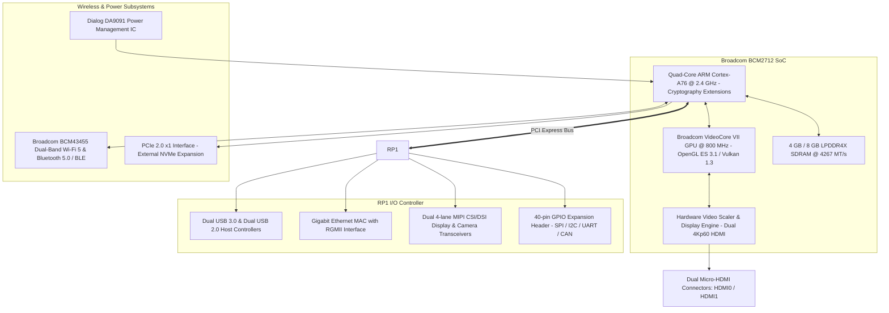
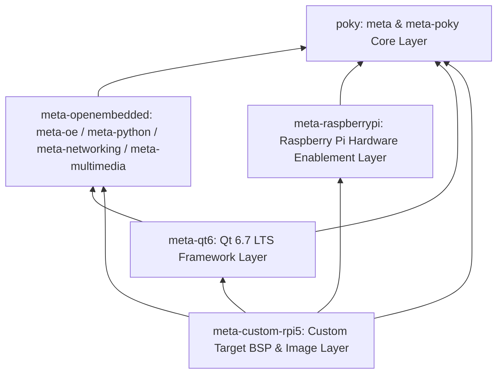
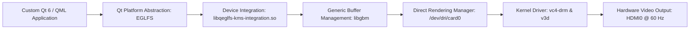

<div align="center">

# meta-custom-rpi5
### Board Support Package & Hardware-Accelerated Qt 6 Platform Layer for Raspberry Pi 5

[](https://www.yoctoproject.org/)
[-C51A4A?style=for-the-badge&logo=raspberrypi&logoColor=white)](https://www.raspberrypi.com/products/raspberry-pi-5/)
[](https://www.qt.io/)
[](https://www.docker.com/)
[-FCC624?style=for-the-badge&logo=linux&logoColor=black)](https://kernel.org/)
[](https://arm.com)

</div>

---

A specialized Yocto Project / OpenEmbedded Board Support Package (BSP) metadata layer configured for the **Raspberry Pi 5** (`BCM2712`, 64-bit `aarch64`), targeting **Yocto Scarthgap (5.0 LTS)**.

This layer provides hardware enablement, Linux kernel configuration, and driver integration for the Broadcom VideoCore VII GPU, direct DRM/KMS EGLFS display pipelines, low-latency audio via PipeWire, multi-touch capacitive input devices, BlueZ 5 Bluetooth stacks, and automated headless network provisioning. It is designed to deploy and execute any custom **Qt 6 application** (automotive IVI, digital signage, industrial HMI, or kiosk) natively on the hardware GPU at 60 FPS.

---

## Hardware Component Architecture

The diagram below details the Raspberry Pi 5 hardware subsystems and board-level interfaces managed by this BSP layer:



---

## Yocto Layer Dependency Stack

The BSP is structured according to OpenEmbedded layer standards, integrating with the upstream Yocto ecosystem:



| Layer Name | Upstream Repository | Branch | Purpose |
| :--- | :--- | :--- | :--- |
| **poky** | `git://git.yoctoproject.org/poky` | `scarthgap` | Base OpenEmbedded build system, BitBake, and core Linux recipes |
| **meta-openembedded** | `git://git.openembedded.org/meta-openembedded` | `scarthgap` | Extended middleware, system utilities, Python 3 libraries, and multimedia |
| **meta-raspberrypi** | `git://git.yoctoproject.org/meta-raspberrypi` | `scarthgap` | Kernel definitions, Broadcom firmware, device tree overlays (`vc4-kms-v3d`) |
| **meta-qt6** | `git://code.qt.io/yocto/meta-qt6.git` | `6.7` | Qt 6.7.x LTS toolchain, QPA platform plugins, and declarative QML modules |
| **meta-custom-rpi5** | `git@github.com:skrehanahamed/meta-custom-rpi5.git` | `main` | Production image recipes, EGLFS KMS integration, autoconfig services |

---

## Graphics & Display Pipeline

To guarantee 60 FPS performance, the display stack operates directly through Linux Kernel Mode Setting (KMS) and Direct Rendering Manager (DRM), bypassing intermediate X11 display servers:



### Key Configuration Settings:
* **Kernel Overlays**: `vc4-kms-v3d` enabled in firmware `config.txt`.
* **Qt Device Integration**: `libqeglfs-kms-integration.so` built with `PACKAGECONFIG:append:pn-qtbase = " eglfs gbm kms"`.
* **Scanout Target**: Direct hardware plane scanout to `/dev/dri/card0` and `/dev/dri/card1`.
* **Execution Parameter**: Launch any custom Qt application with:
  ```bash
  /usr/bin/your_qt_app -platform eglfs
  ```

---

## Layer Structure & Recipe Manifest

```text
meta-custom-rpi5/
├── conf/
│   └── layer.conf                          # Layer registration and priority definition
├── recipes-connectivity/
│   └── rpi-wifi-autoconfig/                # Automated Wi-Fi association and RF kill management
│       ├── files/
│       │   ├── rpi-wifi-autoconfig.service # Systemd network watchdog service
│       │   ├── rpi-wifi-autoconfig.sh      # MicroSD boot-partition hot-drop credential parser
│       └── 25-wlan.network                 # Systemd-networkd dynamic interface configuration
├── recipes-core/
│   └── images/
│       └── rpi5-qt-headless-image.bb       # Complete production bootable disk image recipe
├── recipes-qt/
│   ├── apex-ivi/                           # Apex Automotive Infotainment (D-Audio IVI) recipe
│   │   ├── apex-ivi.bb                     # CMake Qt 6 application recipe & packaging
│   │   └── files/
│   │       ├── apex-ivi.service            # Systemd auto-boot DRM/KMS EGLFS unit
│   │       ├── apex-button-emulator.py     # CAN / rotary knob encoder hardware button daemon
│   │       ├── apex-button-emulator.service# Background systemd rotary key emulator
│   │       ├── kms.json                    # EGLFS KMS display plane and scanout config
│   │       └── asound.conf                 # ALSA audio hardware bridge configuration
│   ├── qt6/                                # Qt 6 framework configuration bbappend
│   │   └── qtbase_%.bbappend               # Enables gbm, kms, and eglfs device integrations
│   └── qt6-sample-app/                     # Touch and graphics validation test harness
│       └── qt6-sample-app.bb
├── scripts/
│   ├── deploy-to-pi.sh                     # Live board deployment utility via SSH
│   └── assemble-image.sh                   # Split image reassembly script
├── .github/
│   └── workflows/
│       └── release-build.yml               # Automated cloud build and release workflow
├── docker/
│   └── Dockerfile                          # Ubuntu 22.04 LTS BitBake build container
├── docker-build.sh                         # Containerized build execution wrapper
└── setup-workspace.sh                      # Layer clone and environment initializer
```

---

## Automotive Audio Architecture (PipeWire & Bluetooth)

This layer provides zero-stutter wireless Bluetooth audio and broadcast radio routing to the vehicle's HDMI speakers:

1. **Deterministic Quantum Lock (`10-audio-stability.conf`)**:
   - Enforces clock quantum of `1024/48000` (21.3ms), matching the Bluetooth A2DP wireless packet burst interval to prevent underruns.
2. **ALSA HDMI Hardware Buffer (`20-ivi-hdmi.conf`)**:
   - Configured with 8 periods × 1024 frames (8192 frames ≈ 170ms) to ensure zero dropouts during CPU-heavy operations.
3. **Telephony & Media Profile Coexistence (`10-bluez-ofono.conf`)**:
   - Supports both `a2dp_sink` (with `[ aac sbc_xq sbc ]` codec prioritization) and `hfp_hf` using the oFono backend.
4. **RF Antenna Coexistence (`70-wifi-powersave.rules`)**:
   - Disables Wi-Fi power-save sleep modes that previously created 300–400ms Bluetooth packet reception blackouts on the shared 2.4 GHz BCM43455 antenna.

---

## Building the Image

### Option A: Local Containerized Build (macOS / Linux)

Prerequisites: Docker or Colima running on the host system.

```bash
# 1. Clone the custom layer
git clone git@github.com:skrehanahamed/meta-custom-rpi5.git
cd meta-custom-rpi5

# 2. Initialize layers and dependencies
./docker-build.sh setup

# 3. Trigger BitBake image build
./docker-build.sh build
```

The resulting flashable disk image will be located at:
```text
build/tmp/deploy/images/raspberrypi5/rpi5-qt-headless-image-raspberrypi5.rootfs.wic.bz2
```

### Option B: Native Linux Build (Ubuntu / Debian / Fedora)

```bash
# Initialize workspace
./setup-workspace.sh

# Source OpenEmbedded build environment
source sources/poky/oe-init-build-env build

# Build the image target
bitbake rpi5-qt-headless-image
```

---

## Flashing the Operating System Image

1. Obtain the generated `.wic.bz2` image file (or download from the GitHub Releases section).
2. Insert a MicroSD card (Class 10 / A2 rating recommended, 16 GB minimum).
3. Open **Raspberry Pi Imager** or **BalenaEtcher**.
4. Select **Use Custom** and select `rpi5-qt-headless-image-raspberrypi5.rootfs.wic.bz2`.
5. Select the destination MicroSD drive and execute **Write**.
6. Insert the MicroSD card into the Raspberry Pi 5 and apply power.

---

## Deploying Your Own Qt Application

To deploy and execute any custom ARM64 Qt 6 binary on the Raspberry Pi 5 with hardware GPU acceleration:

### 1-Click Automated Deployment Script
```bash
# Syntax: ./scripts/deploy-to-pi.sh <path_to_binary> [target_ip_or_hostname]
./scripts/deploy-to-pi.sh ./build/my_qt_app raspberrypi5.local
```
This script automatically:
1. Transfers the compiled ARM64 binary to `/usr/bin/` on the board.
2. Ensures execution permissions.
3. Automatically writes and enables `/etc/systemd/system/qt-app.service` configured with DRM/KMS Atomic EGLFS drivers.
4. Starts the application immediately on the connected HDMI display at 60 FPS.

### Manual Deployment
```bash
# 1. Copy your compiled binary to the target
scp my_custom_app root@raspberrypi5.local:/usr/bin/

# 2. Run fullscreen with hardware GPU acceleration on HDMI
ssh root@raspberrypi5.local "QT_QPA_PLATFORM=eglfs QT_QPA_EGLFS_INTEGRATION=eglfs_kms QT_QPA_EGLFS_KMS_CONFIG=/etc/kms.conf QT_QPA_EGLFS_KMS_ATOMIC=1 /usr/bin/my_custom_app"
```

To configure your application to start automatically on boot, write `/etc/systemd/system/qt-app.service`:
```ini
[Unit]
Description=Qt 6 Native Hardware-Accelerated Application (DRM/KMS EGLFS)
After=systemd-udev-settle.service
Wants=systemd-udev-settle.service

[Service]
Type=simple
User=root
WorkingDirectory=/root
Environment=HOME=/root
Environment=QT_QPA_PLATFORM=eglfs
Environment=QT_QPA_EGLFS_INTEGRATION=eglfs_kms
Environment=QT_QPA_EGLFS_KMS_CONFIG=/etc/kms.conf
Environment=QT_QPA_EGLFS_KMS_ATOMIC=1
Environment=QT_QPA_EGLFS_HIDECURSOR=0
Environment=QSG_INFO=1
ExecStart=/usr/bin/my_custom_app
Restart=always
RestartSec=2

[Install]
WantedBy=multi-user.target
```
Enable and start the service:
```bash
systemctl enable --now qt-app.service
```

---

## Automated GitHub Actions CI/CD Pipeline

The repository features continuous integration via `.github/workflows/release-build.yml`:

* **Release Tag Trigger**: Pushing any tag matching `v*` (for example, `git tag v1.1.0 && git push origin v1.1.0`) triggers an automated build run on a cloud runner.
* **Release Publication**: Upon completion, the pipeline automatically compiles the system, generates SHA256 checksums, and attaches the downloadable `.wic.bz2` disk image, block map, and pre-compiled driver binaries to GitHub Releases.

---

## Target System Specifications

* **Target Architecture**: `aarch64` (ARMv8.2-A / Cortex-A76)
* **Kernel Version**: Linux 6.6.x LTS
* **Init System**: systemd 255
* **Target Hostname**: `raspberrypi5` (mDNS: `raspberrypi5.local`)
* **Default Root Access**: Passwordless SSH (`ssh root@raspberrypi5.local`)
* **Graphics API**: OpenGL ES 3.1 / Vulkan 1.3 / EGLFS DRM KMS
