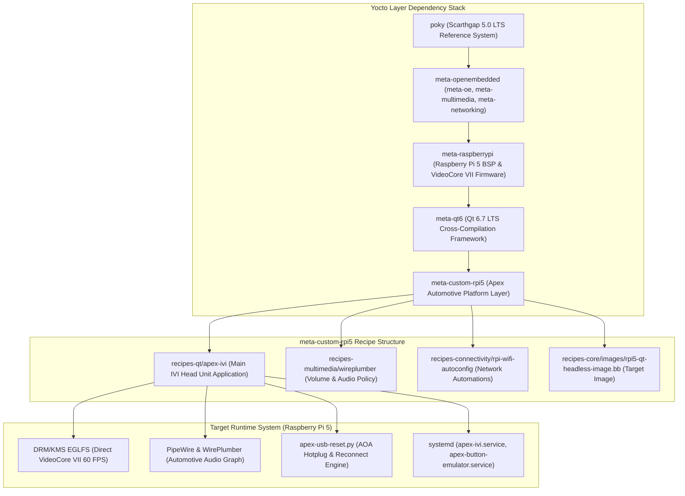
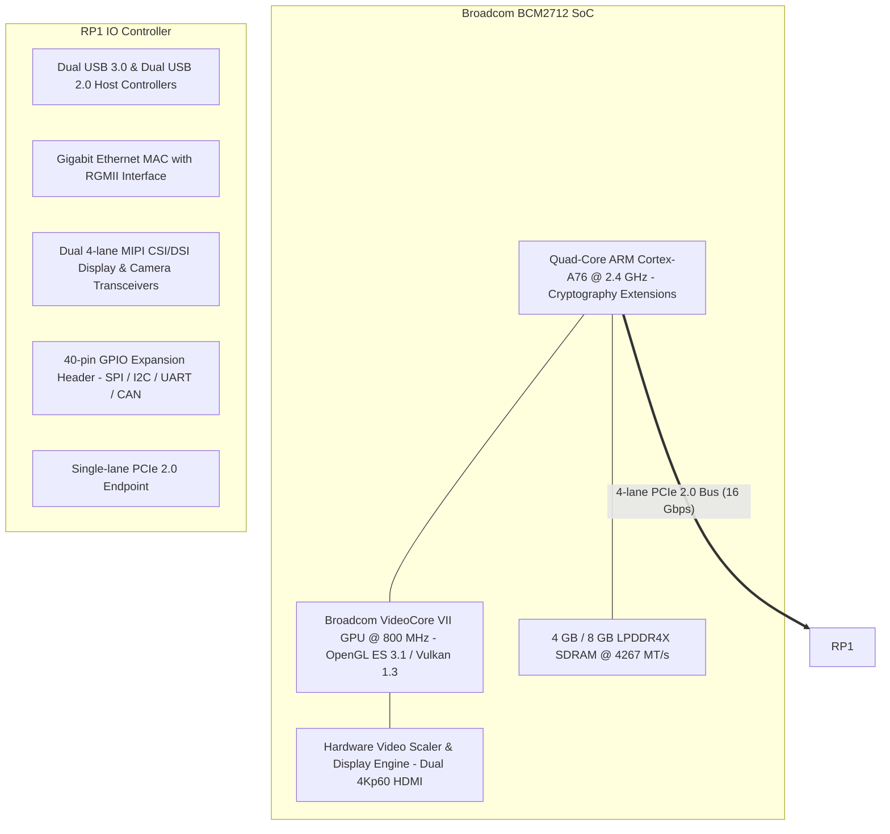

<div align="center">

# meta-custom-rpi5
### Board Support Package and Hardware-Accelerated Qt 6 Platform Layer for Raspberry Pi 5

[](https://www.yoctoproject.org/)
[-C51A4A?style=for-the-badge&logo=raspberrypi&logoColor=white)](https://www.raspberrypi.com/products/raspberry-pi-5/)
[](https://www.qt.io/)
[](https://www.docker.com/)
[-FCC624?style=for-the-badge&logo=linux&logoColor=black)](https://kernel.org/)
[](https://arm.com)

</div>

---

## Overview

meta-custom-rpi5 is a specialized Yocto Project / OpenEmbedded Board Support Package (BSP) metadata layer configured for the Raspberry Pi 5 (BCM2712 Quad-Core Cortex-A76, 64-bit aarch64) on Yocto Scarthgap (5.0 LTS).

This layer provides hardware enablement, Linux kernel configuration, and driver integration for the Broadcom VideoCore VII GPU, direct DRM/KMS EGLFS display pipelines, low-latency audio via PipeWire, multi-touch capacitive touchscreen devices, BlueZ 5 Bluetooth stacks, automated USB accessory reset, and headless automotive appliance execution.

---

## Release Updates: September 14, 2026 (v1.2.0)

Date of Update: September 14, 2026  
Layer Version: v1.2.0

### Key Deliverables and Recipe Integrations Added Today:

1. Automotive Android Auto Protocol Support (`recipes-qt/apex-ivi`)
   - Added build-time dependencies for `libusb1`, `openssl`, `protobuf`, `protobuf-native`, and `boost` to enable embedded AASDK protocol compilation.
   - Integrated AOA 2.0 accessory USB transport handling into the main automotive image.

2. Automated USB Endpoint Reset Tool (`apex-usb-reset.py`)
   - Packaged `/usr/bin/apex-usb-reset.py` into the rootfs via `recipes-qt/apex-ivi/apex-ivi.bb`.
   - Utilizes `USBDEVFS_RESET` ioctl calls to cleanly reset connected Android Open Accessory devices upon deployment or service restart, preventing USB disconnect loops without requiring physical cable removal.

3. Low-Latency PipeWire Audio Configurations
   - Integrated PipeWire quantum and buffer management (`10-audio-stability.conf` and `20-ivi-hdmi.conf`) directly into `/etc/pipewire/pipewire.conf.d/`.
   - Packaged WirePlumber routing rules (`10-bluez-ofono.conf`) into `/etc/wireplumber/wireplumber.conf.d/` for seamless Bluetooth A2DP, oFono telephony, and Android Auto multi-channel audio arbitration.
   - Added systemd drop-in `30-pipewire-audio.conf` establishing deterministic runtime audio environment variables for the IVI application.

4. Continuous Integration Workflow
   - Added `.github/workflows/yocto-layer-ci.yml` to automatically validate layer configurations, syntax of all BitBake recipes, bash deployment scripts, and Python utilities on every pull request and push.

---

## End-to-End Layer Architecture



---

## Hardware Component Architecture

The diagram below details the Raspberry Pi 5 hardware subsystems managed by this BSP layer:



---

## Layer Recipe Hierarchy

```
meta-custom-rpi5/
├── conf/
│   ├── bblayers.conf.sample      # Pre-configured BBLAYERS configuration
│   ├── layer.conf                # Layer metadata and collections definition
│   └── local.conf.sample         # Target machine, DISTRO_FEATURES, and package sets
├── recipes-connectivity/
│   └── rpi-wifi-autoconfig/      # Headless WiFi connection and WPA provisioning
├── recipes-core/
│   └── images/
│       └── rpi5-qt-headless-image.bb # Minimalist, automotive rootfs definition
├── recipes-multimedia/
│   └── wireplumber/
│       └── wireplumber_%.bbappend # Default volume and session management
└── recipes-qt/
    ├── apex-ivi/
    │   ├── apex-ivi.bb           # Apex IVI application recipe
    │   └── files/
    │       ├── 10-audio-stability.conf # PipeWire buffer and latency settings
    │       ├── 20-ivi-hdmi.conf        # PipeWire dedicated HDMI audio sink
    │       ├── 10-bluez-ofono.conf     # WirePlumber Bluetooth/telephony policy
    │       ├── 30-pipewire-audio.conf  # systemd environment drop-in
    │       ├── apex-button-emulator.py # GPIO steering button simulator
    │       ├── apex-button-emulator.service
    │       ├── apex-ivi.service        # Fullscreen appliance systemd unit
    │       ├── apex-usb-reset.py       # USB AOA endpoint reset script
    │       ├── asound.conf             # ALSA compatibility layer
    │       └── kms.json                # Direct DRM/KMS connector configuration
    └── qt6/
        └── qtbase_%.bbappend     # EGLFS KMS GBM driver enablement
```

---

## Building the Image

### Prerequisites
- Linux build host running Docker with at least 150 GB free disk space.

### Building via Docker
```bash
# Clone the repository and submodules
git clone --recursive https://github.com/skrehanahamed/meta-custom-rpi5.git
cd meta-custom-rpi5

# Build the complete Yocto Scarthgap OS image
./docker-build.sh
```

### Flashing to SD Card or NVMe
```bash
# Decompress and write image
bzcat rpi5-qt-headless-image-raspberrypi5.rootfs.wic.bz2 | sudo dd of=/dev/sdX bs=4M status=progress conv=fsync
```

---

## GitHub Actions Continuous Integration

The layer includes continuous integration workflows in `.github/workflows/`:

- `yocto-layer-ci.yml`: Validates layer configurations, recipe file structures, bash script syntax, and Python scripts across the repository.
- `release-build.yml`: Orchestrates complete containerized Yocto image builds on tagged releases.

---

## Third-Party Credits and Acknowledgments

We gratefully acknowledge the following open-source projects, organizations, and contributors:

- The Yocto Project & OpenEmbedded: The industry reference framework for custom embedded Linux operating systems.
- Raspberry Pi Ltd.: Board support packages, kernel trees, and VideoCore firmware development.
- f1xpl / aasdk: Foundational C++ implementation of the Android Auto protocol SDK.
- f1xpl / openauto and opencardev / crankshaft: Landmark automotive platforms that paved the way for open-source digital head units on Raspberry Pi.
- Steffen K. / aa-proxy-rs: High-performance Rust reverse-engineering reference for Android Auto USB AOA protocol handling.
- PipeWire & WirePlumber Projects: Groundbreaking pro-audio and automotive low-latency multimedia routing framework.
- The Qt Project: Cross-platform GUI framework and Qt 6 EGLFS platform plugins.

---

## License

This project is licensed under the MIT License - see the [LICENSE](LICENSE) file for details.
